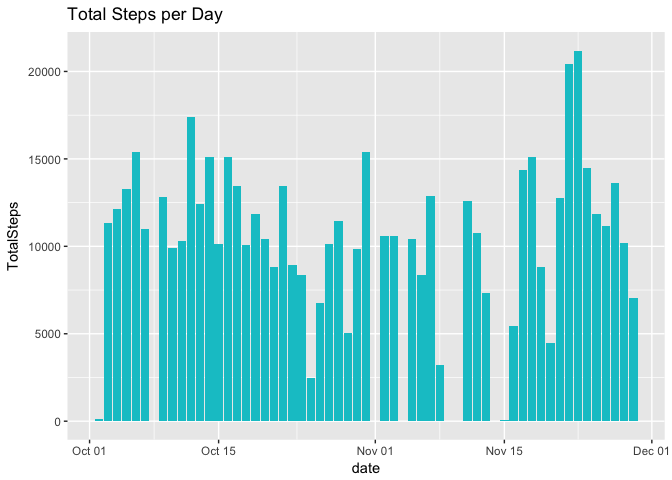
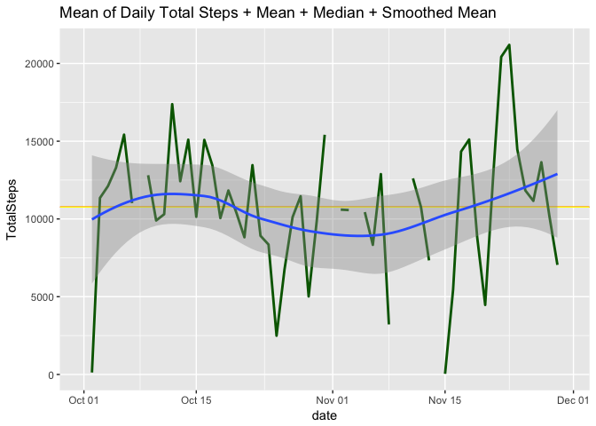
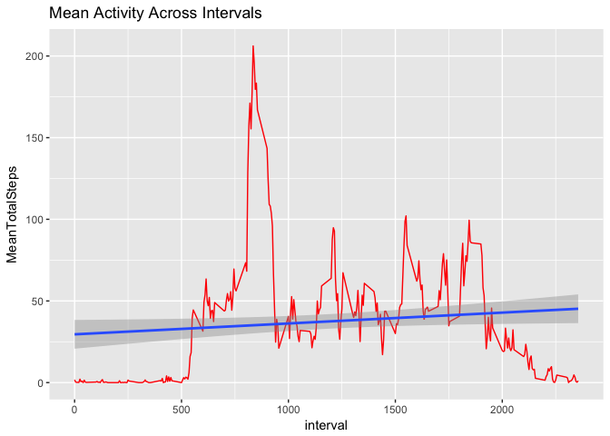
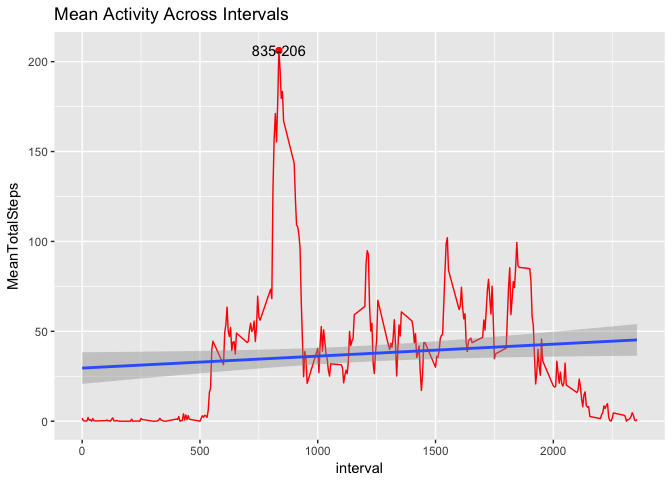
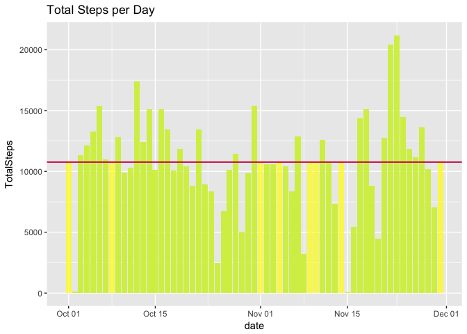
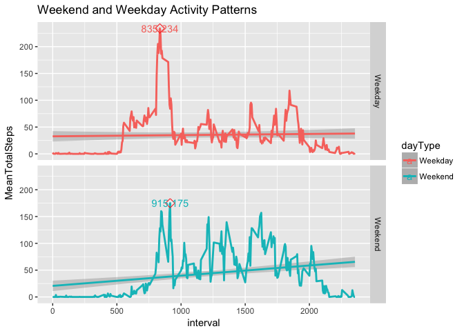

```r
knitr::opts_chunk$set(warning = FALSE, echo = TRUE)

library(readr)
library(xtable)
library(dplyr)
```

```
## Warning: package 'dplyr' was built under R version 3.4.2
```

```
## 
## Attaching package: 'dplyr'
```

```
## The following objects are masked from 'package:stats':
## 
##     filter, lag
```

```
## The following objects are masked from 'package:base':
## 
##     intersect, setdiff, setequal, union
```

```r
library(tidyr)
```

```
## Warning: package 'tidyr' was built under R version 3.4.2
```

```r
library(ggplot2)
library(knitr)
```

```
## Warning: package 'knitr' was built under R version 3.4.3
```
## Introduction

It is now possible to collect a large amount of data about personal
movement using activity monitoring devices such as a
[Fitbit](http://www.fitbit.com), [Nike
Fuelband](http://www.nike.com/us/en_us/c/nikeplus-fuelband), or
[Jawbone Up](https://jawbone.com/up). These type of devices are part of
the "quantified self" movement -- a group of enthusiasts who take
measurements about themselves regularly to improve their health, to
find patterns in their behavior, or because they are tech geeks. But
these data remain under-utilized both because the raw data are hard to
obtain and there is a lack of statistical methods and software for
processing and interpreting the data.

This assignment makes use of data from a personal activity monitoring
device. This device collects data at 5 minute intervals through out the
day. The data consists of two months of data from an anonymous
individual collected during the months of October and November, 2012
and include the number of steps taken in 5 minute intervals each day.

## Data

The data for this assignment can be downloaded from the course web
site:

* Dataset: [Activity monitoring data](https://d396qusza40orc.cloudfront.net/repdata%2Fdata%2Factivity.zip) [52K]

The variables included in this dataset are:

* **steps**: Number of steps taking in a 5-minute interval (missing
    values are coded as `NA`)

* **date**: The date on which the measurement was taken in YYYY-MM-DD
    format

* **interval**: Identifier for the 5-minute interval in which
    measurement was taken


The dataset is stored in a comma-separated-value (CSV) file and there
are a total of 17,568 observations in this
dataset.

## Assignment

This assignment will be described in multiple parts. You will need to
write a report that answers the questions detailed below. Ultimately,
you will need to complete the entire assignment in a **single R
markdown** document that can be processed by **knitr** and be
transformed into an HTML file.

Throughout your report make sure you always include the code that you
used to generate the output you present. When writing code chunks in
the R markdown document, always use `echo = TRUE` so that someone else
will be able to read the code. **This assignment will be evaluated via
peer assessment so it is essential that your peer evaluators be able
to review the code for your analysis**.

For the plotting aspects of this assignment, feel free to use any
plotting system in R (i.e., base, lattice, ggplot2)

Fork/clone the [GitHub repository created for this
assignment](http://github.com/rdpeng/RepData_PeerAssessment1). You
will submit this assignment by pushing your completed files into your
forked repository on GitHub. The assignment submission will consist of
the URL to your GitHub repository and the SHA-1 commit ID for your
repository state.

NOTE: The GitHub repository also contains the dataset for the
assignment so you do not have to download the data separately.


### Loading and preprocessing the data

In this section we look at the data and perform some exploratory analysis.


```r
# Unzip file
unzip("activity.zip", overwrite = TRUE)
# load file

activity <- read_csv("activity.csv")
```

```
## Parsed with column specification:
## cols(
##   steps = col_integer(),
##   date = col_date(format = ""),
##   interval = col_integer()
## )
```

Some stats about the file:


```r
#
knitr::kable(summary(activity))
```

         steps             date               interval    
---  ---------------  -------------------  ---------------
     Min.   :  0.00   Min.   :2012-10-01   Min.   :   0.0 
     1st Qu.:  0.00   1st Qu.:2012-10-16   1st Qu.: 588.8 
     Median :  0.00   Median :2012-10-31   Median :1177.5 
     Mean   : 37.38   Mean   :2012-10-31   Mean   :1177.5 
     3rd Qu.: 12.00   3rd Qu.:2012-11-15   3rd Qu.:1766.2 
     Max.   :806.00   Max.   :2012-11-30   Max.   :2355.0 
     NA's   :2304     NA                   NA             

```r
#
```
Display the first and last ten records:


```r
knitr::kable(head(activity), caption = "First ten records")
```


Table: First ten records

 steps  date          interval
------  -----------  ---------
    NA  2012-10-01           0
    NA  2012-10-01           5
    NA  2012-10-01          10
    NA  2012-10-01          15
    NA  2012-10-01          20
    NA  2012-10-01          25

```r
#
knitr::kable(tail(activity), caption = "Last ten Records")
```


Table: Last ten Records

 steps  date          interval
------  -----------  ---------
    NA  2012-11-30        2330
    NA  2012-11-30        2335
    NA  2012-11-30        2340
    NA  2012-11-30        2345
    NA  2012-11-30        2350
    NA  2012-11-30        2355


### What is mean total number of steps taken per day?

For this part of the assignment, you can ignore the missing values in
the dataset.

#### 1. Make a histogram of the total number of steps taken each day

The following code displays the total number of steps, discarding null or NA values:


```r
result <- activity %>%
  group_by(date) %>%
  summarise(TotalSteps = sum(steps)) %>%
  select(date, TotalSteps)

ggplot(data = result) + geom_histogram( aes(x = date, y = TotalSteps), stat = "identity", fill="turquoise3") + 
  ggtitle("Total Steps per Day")
```

<!-- -->

#### 2. Calculate and report the **mean** and **median** total number of steps taken per day

A concise view of mean and median is shown below:

```r
print(summary(result$TotalSteps), type = "html")
```

```
##    Min. 1st Qu.  Median    Mean 3rd Qu.    Max.    NA's 
##      41    8841   10765   10766   13294   21194       8
```


The Mean Total Number of Steps per Day is = **1.0766\times 10^{4}**


The Median Total Number of Steps per Day is = **1.0765\times 10^{4}**


There is not much difference between the values as it is shown in the diagram below, where a red line was used to represent the average and the yellow to represent the median.


The following plot shows the total daily steps across time, the average and the smoothed conditional mean:


```r
ggplot(data=result, aes(x=date, y = TotalSteps)) + 
  geom_hline(yintercept=mean(result$TotalSteps, na.rm= TRUE), color = "red", lwd = 0.5) +
  geom_hline(yintercept=median(result$TotalSteps, na.rm= TRUE), color = "yellow", lwd = 0.5) +
  geom_line(lwd = 1, color = "dark green") +
  ggtitle("Mean of Daily Total Steps + Mean + Median + Smoothed Mean") + geom_smooth(method="loess") 
```

<!-- -->


### What is the average daily activity pattern?

#### 1. Make a time series plot (i.e. 'type = "l"') of the 5-minute interval (x-axis) and the average number of steps taken, averaged across all days (y-axis)

For the purpose of this question the daily pattern is the number of steps in the different intervals of the day, as determined by the field *interval*.

The following plot shows the activity per interval in a day, across all days:


```r
result <- activity %>%
  group_by(interval) %>%
  summarise(MeanTotalSteps = mean(steps, na.rm = TRUE)) %>%
  select(interval, MeanTotalSteps)

ggplot(data = result, aes(x = interval, y = MeanTotalSteps)) + geom_line(color = "red") +
  ggtitle("Mean Activity Across Intervals") +
  geom_smooth(method = "lm") 
```

<!-- -->

#### 2. Which 5-minute interval, on average across all the days in the dataset, contains the maximum number of steps?

The following diagram displays the maximum number of steps:


```r
result <- activity %>%
  group_by(interval) %>%
  summarise(MeanTotalSteps = mean(steps, na.rm = TRUE)) %>%
  select(interval, MeanTotalSteps)

result2 <- result %>%
  filter(MeanTotalSteps == max(MeanTotalSteps))

ggplot(data = result, aes(x = interval, y = MeanTotalSteps)) + geom_line(color = "red") +
  ggtitle("Mean Activity Across Intervals") + 
  geom_point(data =  result2, aes(x=interval, y = MeanTotalSteps), color = "red", pch=20, 
             size = 3) +
  geom_text(data=result2, aes(x=interval, y = MeanTotalSteps, 
                              label = paste0(interval,"-",round(MeanTotalSteps))),
            position = position_dodge(width= 1.5)) +
  geom_smooth(method = "lm") 
```

<!-- -->


### Imputing missing values

Note that there are a number of days/intervals where there are missing
values (coded as `NA`). The presence of missing days may introduce
bias into some calculations or summaries of the data.

#### 1. Calculate and report the total number of missing values in the dataset (i.e. the total number of rows with `NA`s)


```r
result <- summary(activity)
knitr::kable(summary(activity), caption = "Overview")
```


Table: Overview

         steps             date               interval    
---  ---------------  -------------------  ---------------
     Min.   :  0.00   Min.   :2012-10-01   Min.   :   0.0 
     1st Qu.:  0.00   1st Qu.:2012-10-16   1st Qu.: 588.8 
     Median :  0.00   Median :2012-10-31   Median :1177.5 
     Mean   : 37.38   Mean   :2012-10-31   Mean   :1177.5 
     3rd Qu.: 12.00   3rd Qu.:2012-11-15   3rd Qu.:1766.2 
     Max.   :806.00   Max.   :2012-11-30   Max.   :2355.0 
     NA's   :2304     NA                   NA             

The number of NA is as follows:  **NA's   :2304  ** and it affects only the **steps** vartiable.

#### 2. Devise a strategy for filling in all of the missing values in the dataset. The strategy does not need to be sophisticated. For example, you could use the mean/median for that day, or the mean for that 5-minute interval, etc.

As a strategy for deling with NA values, it was noted that only the variable **steps** contains NA values.

The approach is to replace the missing values with the interval total  and with the overall mean total if none is available (*overallMeanDayTotal*).


```r
activity2 <- activity %>%
  group_by(interval) %>%
  summarise(intervalSum_mean = mean(steps, na.rm = TRUE)) %>%
  left_join(activity, by = c("interval" = "interval")) %>%
  mutate(intervalAvg = ifelse(is.na(steps), intervalSum_mean, steps)) %>%
  select(steps = intervalAvg, date, interval) %>%
  mutate(steps = round(steps, digits = 2)) %>%
  arrange(date, interval)

print(summary(activity2))
```

```
##      steps             date               interval     
##  Min.   :  0.00   Min.   :2012-10-01   Min.   :   0.0  
##  1st Qu.:  0.00   1st Qu.:2012-10-16   1st Qu.: 588.8  
##  Median :  0.00   Median :2012-10-31   Median :1177.5  
##  Mean   : 37.38   Mean   :2012-10-31   Mean   :1177.5  
##  3rd Qu.: 27.00   3rd Qu.:2012-11-15   3rd Qu.:1766.2  
##  Max.   :806.00   Max.   :2012-11-30   Max.   :2355.0
```

After this no NA's are now present.


#### 3. Create a new dataset that is equal to the original dataset but with the missing data filled in.

A new dataset **activity2** was created in the previous step.


#### 4. Make a histogram of the total number of steps taken each day and Calculate and report the **mean** and **median** total number of steps taken per day. Do these values differ from the estimates from the first part of the assignment? What is the impact of imputing missing data on the estimates of the total daily number of steps?

In order to compare I have used semitransparent colours, turquoise for the data from the original dataset and yellow for the activity of the second dataset.

A pure colour, represents no overlaps, whilst green represent an overlap. 

A red line represents the mean for the second dataset, a blue line represents the mean for the first dataset.


```r
result <- activity %>%
  group_by(date) %>%
  summarise(TotalSteps = sum(steps)) %>%
  select(date, TotalSteps)

result2 <- activity2 %>%
  group_by(date) %>%
  summarise(TotalSteps = sum(steps)) %>%
  select(date, TotalSteps)

ggplot(data = result) + geom_histogram( aes(x = date, y = TotalSteps), stat = "identity", fill="turquoise3", alpha= 0.7) + 
  ggtitle("Total Steps per Day") +
  geom_histogram(data = result2, aes(x = date, y = TotalSteps), stat = "identity", fill="yellow", alpha= 0.7) +
  geom_hline(yintercept = mean(result$TotalSteps, na.rm=TRUE), color = "blue") +
geom_hline(yintercept = mean(result2$TotalSteps, na.rm=TRUE), color = "red")
```

<!-- -->

There are no partial overlaps as the colours in the diagram are either yellow (no overlap, belonging to the second dataset) or green (full overlap).

Because of the chosen strategy no real differences were found in mean and median for the two datasets:


```r
print(summary(result$TotalSteps))
```

```
##    Min. 1st Qu.  Median    Mean 3rd Qu.    Max.    NA's 
##      41    8841   10765   10766   13294   21194       8
```

```r
print(summary(result$TotalSteps))
```

```
##    Min. 1st Qu.  Median    Mean 3rd Qu.    Max.    NA's 
##      41    8841   10765   10766   13294   21194       8
```


### Are there differences in activity patterns between weekdays and weekends?

For this part the `weekdays()` function may be of some help here. Use
the dataset with the filled-in missing values for this part.

1. Create a new factor variable in the dataset with two levels -- "weekday" and "weekend" indicating whether a given date is a weekday or weekend day.

2. Make a panel plot containing a time series plot (i.e. `type = "l"`) of the 5-minute interval (x-axis) and the average number of steps taken, averaged across all weekday days or weekend days (y-axis). The plot should look something like the following, which was created using **simulated data**:

For the calculation we need to distinguish between weekdays and weekends.

The definition of daily activity pattern will be the same one calculated earlier and based on the interval.

Below a plot comparing the daily activity patterns of weekdays and weekends.


```r
result <- activity %>%
  mutate(weekday = weekdays(date)) %>%
  mutate(dayType = ifelse(weekday == "Saturday" | weekday == "Sunday", "Weekend", "Weekday")) %>%
  group_by(dayType,interval) %>%
  summarise(MeanTotalSteps = mean(steps, na.rm = TRUE)) %>%
  select(dayType, interval, MeanTotalSteps)
  
result2 <- result %>%
  filter((MeanTotalSteps == max(MeanTotalSteps) & dayType == "Weekday") |
           (MeanTotalSteps == max(MeanTotalSteps) & dayType == "Weekend"))
#
ggplot(data =result, aes(x=interval, y = MeanTotalSteps, color = dayType))  +
  ggtitle("Weekend and Weekday Activity Patterns") +
  geom_smooth(data = subset(result, dayType == "Weekend"), method = "lm") +
  geom_smooth(data = subset(result, dayType == "Weekday"), method = "lm") +
  geom_line(lwd = 1) +facet_grid(dayType ~ .) +
  geom_point(data =  result2, aes(x=interval, y = MeanTotalSteps), color = "red", pch=5, 
             size = 3) +
  geom_text(data=result2, aes(x=interval, y = MeanTotalSteps, 
                              label = paste0(interval,"-",round(MeanTotalSteps))),
            position = position_dodge(width= 1.5))
```

<!-- -->

From the plot it is possible to spot differences between Weekdays, where the activity pattern is higher in the first part of the measuring and lower for the remaining of the day, with the exception of around interval 1750.
